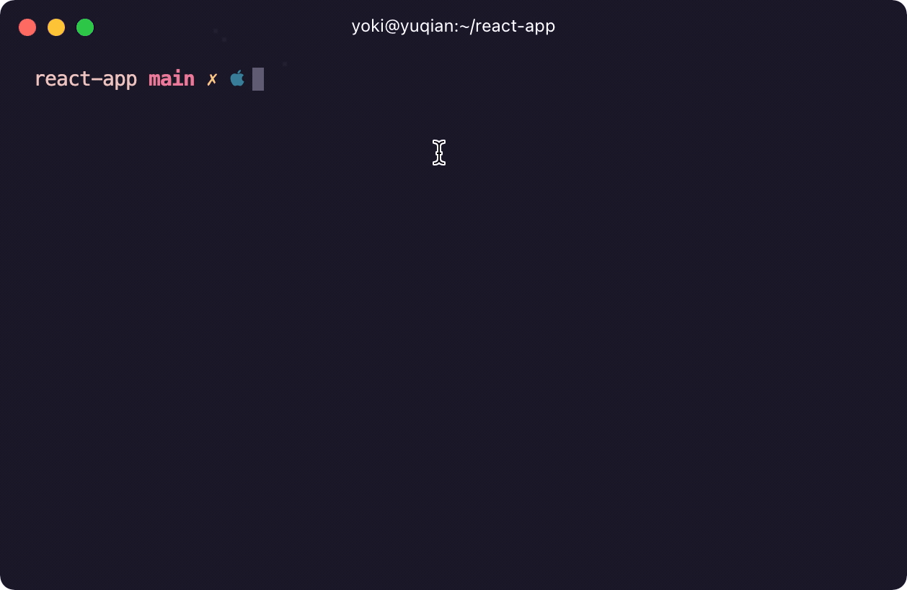

# Clear create-react-app

<p align="center">
  
</p>

**After** you have created your React project with create-react-app, you can clean it up with:

`npx clear-cra`

This is a very simple package that tries to remove and edit boilerplate files after you have run create-react-app.

This is very usefull when you don't want to remove and edit all files yourself.

## Which files are removed?

These are the files that clear-cra prefers to remove:

- src/App.css (you can choose to keep)
- src/App.test.js (you can choose to keep)
- src/setupTests.js (you can choose to keep)
- src/reportWebVitals.js
- src/logo.svg
- public/manifest.json (you can choose to keep)
- public/logo192.png (you can choose to keep)
- public/logo512.png (you can choose to keep)

You can also edit `removeFiles` field by `clearcra.config.json`. See [clearcra.config.json](#clearcra-config)

## Which files are changed?

These are the files that clear-cra tries to change, with resulting code below each file:

- src/index.js

```javascript
import React from "react";
import ReactDOM from "react-dom";
import "./index.css";
import App from "./App";

ReactDOM.render(
  <React.StrictMode>
    <App />
  </React.StrictMode>,
  document.getElementById("root")
);
```

- src/index.css

```css
body {
  margin: 0;
}
```

- src/App.js

```javascript
// import only if "Keep src/App.css" is chosen:
import "./App.css";

function App() {
  return (
    null
  );
}

export default App;
```

- public/index.html

```html
<!DOCTYPE html>
<html lang="en">
<head>
  <meta charset="utf-8" />
  <link rel="icon" href="%PUBLIC_URL%/favicon.ico" />
  <meta name="viewport" content="width=device-width, initial-scale=1" />
  <meta name="theme-color" content="#000000" />
  <meta
    name="description"
    content="Web site created using create-react-app"
  />
  <!-- Added only if "keep src/manifest.json" is chosen: -->
  <link rel="apple-touch-icon" href="%PUBLIC_URL%/logo192.png" />
  <!-- Added only if "keep src/manifest.json" is chosen: -->
  <link rel="manifest" href="%PUBLIC_URL%/manifest.json" />
  <title>React App</title>
</head>
<body>
  <noscript>You need to enable JavaScript to run this app.</noscript>
  <div id="root"></div>
</body>
</html>
```

## Clearcra Config

Create `clearcra.config.json` in your project's root path.

```json
{
  "removeFiles": ["src/App.css"],
  "addFolders": ["src/constants"]
}
```

## Bonus!

If you select the context folder option, you are asked if you also want to create a global provider.
This is a provider you can use to store global states, and then share these states with any component inside the provider (also deeply nested components).

### Create it
If you choose to create this provider, two things happen:
1) A `GlobalContext.js` -file is created inside the `context` -folder.
2) The provider from `GlobalContext.js` is "wrapped" around the return-content in `App.js`

`App.js` will then look something like this:

```javascript
import { GlobalProvider } from "./contexts/GlobalContext";

function App() {
  return (
    <GlobalProvider value={{}}>
      {null}
    </GlobalProvider>
  );
}

export default App;
```

### Setup
The `value` -prop is where all shared data should go, and off course, you, decide what should go in there, but to show you an example, it would look something like this:

```javascript
import { GlobalProvider } from "./contexts/GlobalContext";

function App() {
  var [darkmode, setDarkmode] = useState(false);

  return (
    <GlobalProvider value={{
      darkmode, setDarkmode
    }}>
      <SomeComponent />
      <SomeOtherComponent />
    </GlobalProvider>
  );
}

export default App;
```

Now all components you add inside `<GlobalProvider>` (like `<SomeComponent />` and `<SomeOtherComponent />`) will have access to `darkmode` and `setDarkmode`.

If you need more state, just add it:

```javascript
import { GlobalProvider } from "./contexts/GlobalContext";

function App() {
  var [darkmode, setDarkmode] = useState(false);
  var [someState, setSomeState] = useState({});

  return (
    <GlobalProvider value={{
      darkmode, setDarkmode,
      someState, setSomeState
    }}>
      <SomeComponent />
      <SomeOtherComponent />
    </GlobalProvider>
  );
}

export default App;
```

If you need more components to have access to these states, just add them inside the provider:

```javascript
import { GlobalProvider } from "./contexts/GlobalContext";

function App() {
  var [darkmode, setDarkmode] = useState(false);
  var [someState, setSomeState] = useState({});

  return (
    <GlobalProvider value={{
      darkmode, setDarkmode,
      someState, setSomeState
    }}>
      <SomeComponent />
      <SomeOtherComponent />
      <SomeThirdComponent />
      <SomethingCompletelyDifferent />
      <CantThinkOfAnyNames />
      <AaaaarGh />
    </GlobalProvider>
  );
}

export default App;
```

### Usage
One thing is to create access to global states, but we also need to "grab" these states inside other (child) components.
As an example, let's say you need:

1) `setDarkmode` in `<SomeComponent />`
2) `darkmode` in `<SomeOtherComponent />`
3) `darkmode` and `setDarkmode` in `<CantThinkOfAnyNames />`

you can use the `useGlobalContext` -hook to "grab" these values from the context:

#### SomeComponent
```javascript
import useGlobalContext from "../contexts/GlobalContext";

function SomeComponent(){
  var {setDarkmode} = useGlobalContext();

  return (
    // Use setDarkmode for whatever
  );
}

export default SomeComponent;
```

#### SomeOtherComponent
```javascript
import useGlobalContext from "../contexts/GlobalContext";

function SomeOtherComponent(){
  var {darkmode} = useGlobalContext();

  return (
    // Use darkmode for whatever
  );
}

export default SomeOtherComponent;
```

#### CantThinkOfAnyNames
```javascript
import useGlobalContext from "../contexts/GlobalContext";

function CantThinkOfAnyNames(){
  var {darkmode, setDarkmode} = useGlobalContext();

  return (
    // Use darkmode and setDarkmode for whatever
  );
}

export default CantThinkOfAnyNames;
```